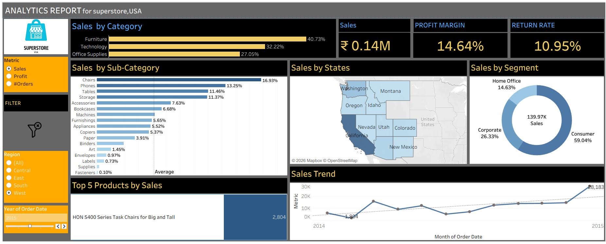

# 📊 Superstore Sales Analytics Dashboard (Tableau)

## 🔹 Project Overview
This project is an interactive Tableau dashboard built using the Superstore dataset to analyze sales performance, profitability, and business trends across categories, regions, and time.

---

## 🔹 Dashboard Features

✔ Sales by Category  
✔ Sales by Sub-Category  
✔ Profit Margin & Return Rate KPIs  
✔ Regional Sales Map  
✔ Segment-wise Sales Distribution  
✔ Monthly Sales Trend Analysis  
✔ Top 5 Products by Sales  

---

## 🔹 Key Insights

- Technology category contributes the highest sales.
- Consumer segment generates the largest revenue share.
- Western region shows strong sales performance.
- Sales trend shows growth toward year end.

---

## 🔹 Tools Used

- Tableau Desktop Public Edition
- Superstore Dataset
- Data Visualization Techniques

---

## 🔹 How to View

1. Download the `.twbx` file
2. Open using Tableau Desktop or Tableau Public

---

## 🔹 Dashboard Preview

